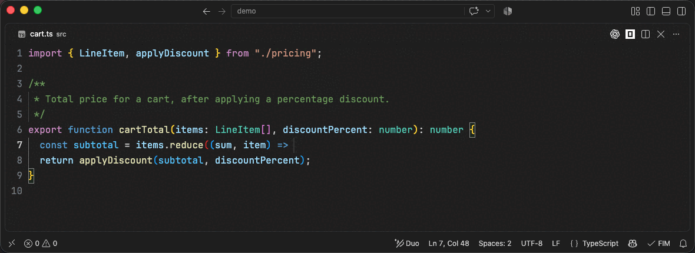

# FIM Autocomplete

Inline code completion (fill-in-the-middle) for VS Code, backed by any LLM
provider you point it at. No chat, no agent, no codebase indexing — just
autocomplete.

This is a fork of [Continue](https://github.com/continuedev/continue) reduced to
its autocomplete engine. See [NOTICE](./NOTICE) for what changed.



## Install

Grab the `.vsix` from the [latest release](https://github.com/dkruyt/FIM-Autocomplete/releases)
and install it:

```bash
code --install-extension fim-autocomplete-0.1.0.vsix
```

Then configure a model — nothing happens until you do.

## Configuring a model

The quickest path is the guided picker: **FIM: Select Model** in the command
palette, or the `FIM` status bar item → **Select model…**. It's built from native
QuickPicks (this extension has no webview) and queries the provider for its
available models where that's supported.

Or set it by hand — `provider` and `model` are the only required fields:

```jsonc
{
  "fim.model": {
    "provider": "ollama",
    "model": "qwen2.5-coder:1.5b",
    "apiBase": "http://localhost:11434",
  },
}
```

Models with a native fill-in-the-middle endpoint give the best results —
Codestral, DeepSeek Coder, Qwen Coder, StarCoder, CodeGemma, Mellum. Hosted
example:

```jsonc
{
  "fim.model": {
    "provider": "mistral",
    "model": "codestral-latest",
    "apiKey": "...",
  },
}
```

> `apiKey` lives in `settings.json` in plaintext and will sync via Settings Sync.

The FIM prompt template is autodetected from the model name. Override it with
`fim.model.template` (a Handlebars string with `{{{prefix}}}` / `{{{suffix}}}` /
`{{{filename}}}` / `{{{language}}}` / `{{{reponame}}}`) when autodetection picks
wrong — for instance to drive an instruct-tuned model that doesn't understand raw
FIM sentinel tokens.

See the full option list under **Settings → Extensions → FIM Autocomplete**, or
search `fim.` in `settings.json`.

## Using it

Type, pause, and the suggestion shows up as grey ghost text after the cursor.

| To do this                   | Press                           |
| ---------------------------- | ------------------------------- |
| Accept the whole suggestion  | `Tab`                           |
| Accept just the next word    | `cmd+→` / `ctrl+→`              |
| Dismiss it                   | `Esc`                           |
| Ask for one right now        | `cmd+alt+\` / `ctrl+alt+\`      |
| Turn autocomplete off and on | `cmd+k cmd+a` / `ctrl+k ctrl+a` |

The `FIM` status bar item shows state (`$(check)` idle, `$(loading~spin)` waiting
on the model, `$(circle-slash)` disabled, `$(debug-pause)` paused on battery) and
opens a menu with **Select model…** and a link to all settings.

If nothing appears, the usual cause is a model that isn't a fill-in-the-middle
code model. The
[extension README](extensions/vscode/README.md#when-nothing-appears) has the full
troubleshooting list, plus notes on truncated suggestions and which files are
excluded by default.

## How a completion is built

Beyond the text around the cursor, the prompt draws on:

- definitions of imported symbols (tree-sitter `import-queries` + LSP go-to-definition)
- the enclosing class/function signature and the types it references (`root-path-context`)
- recently edited ranges, recently visited ranges, recently opened files
- optionally the clipboard, and optionally static analysis of types/headers

Most sources can be toggled via `fim.*` settings, and all of them are raced
against a per-source timeout so a slow source can't stall a keystroke. This is
the part of Continue worth keeping over a naive FIM plugin.

Upstream also had a git-diff source, but it was disabled there and remains
disabled here — a diff is usually large enough to crowd everything else out of
the token budget.

## Repository layout

```
core/                     the completion engine (provider-agnostic)
  autocomplete/           prefilter → debounce → snippets → template → stream → postprocess
    context/              cross-file context: imports, root-path, static analysis
    snippets/             assembles all context sources with per-source timeouts
    templating/           16 model-specific FIM templates + token budgeting
    filtering/            bracket matching, stream transforms, stop conditions
    postprocessing/       final accept/reject of a candidate completion
  llm/                    BaseLLM + 61 providers, tokenizers, token counting
  util/                   uri/path helpers, tree-sitter loading, LRU caches
  indexing/               only ignore.ts, fimignore.ts, chunk/code.ts
  vendor/tree-sitter.wasm the tree-sitter runtime

extensions/vscode/        the VS Code extension
  src/autocomplete/       InlineCompletionItemProvider, status bar, LSP bridge, trackers
  src/config/FimConfig.ts reads `fim.*` settings and builds the ILLM
  src/VsCodeIde.ts        the IDE interface implementation
  tree-sitter/            .scm queries for the context sources

packages/                 vendored sub-packages, consumed as file: deps
  fetch, llm-info, openai-adapters
```

## Development

See [CONTRIBUTING.md](./CONTRIBUTING.md). Short version: install `packages/`
first (order matters), then `core`, then the extension; press <kbd>F5</kbd>.

## Relationship to upstream

`core/autocomplete/**` is deliberately left close to upstream so autocomplete
fixes can still be cherry-picked. Two seams will conflict on any upstream change
to the completion provider, and are kept small on purpose:

- `CompletionProvider` takes an `AutocompleteConfigProvider` instead of
  Continue's `ConfigHandler`
- Next Edit has been removed from the VS Code inline completion provider

## License

Apache 2.0 — see [LICENSE](./LICENSE) and [NOTICE](./NOTICE).
Original work © 2023-2026 Continue Dev, Inc.
